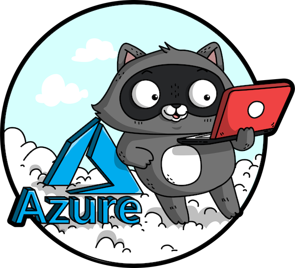

# Azure 中文精选



## 我们的目标

Azure中文精选旨在精挑细选微软[Azure云计算平台](https://azure.microsoft.com/?WT.mc_id=azureselected-content-xinglzhu)的实际应用和开发经验等优质内容，然后将这些内容进行中文本地化翻译，力图为中文环境的Azure开发者提供学习和参考资料。

该项目库是为译者和校验等志愿者提供的协作平台，我们将翻译好的内容会推送给国内多个开发者渠道。

## 内容来源

目前内容来自微软的[云大使（Cloud Advocate）](https://developer.microsoft.com/advocates/?WT.mc_id=azureselected-content-xinglzhu)的原创内容，他们根据实际场景创造了非常多的指导和最佳实践。我们每月会精选几篇文章进行本地化。

## 协作模式

~~首先报名成为志愿者，目前在[招募译者](#)。有翻译和审阅等角色。~~

### 内容目录结构

```
/content/cloud-advocate/2020-02/ 👈 这是英文原文存放路径，每个月会有一个目录。
- deploy-javaee-to-azure-1.md 👈 在每月的目录下，存放了待翻译的原文文章。
/zh-cn/content/cloud-advocate/2020-02/ 👈 这里放简体中文的译文，也是每个月一个目录，对应原文。
- deploy-javaee-to-azure-1.md 👈 保留原始文件名，复制到这里开始简体中文的本地化
/zh-tw/content/cloud-advocate/2020-02/ 👈 这里是繁体中文的译文目录，也需要对应原文。
- deploy-javaee-to-azure-1.md 👈 也要保留原始文件名，复制英文原文到这里，开始繁体中文的本地化
```

## 翻译步骤

1. 查看GitHub上的[Issue列表](https://github.com/azureselected/azureselected/issues)，标记为`New`的是新发布的原文内容，马上认领吧。
2. 在Issue下回复认领，修改任务分配给自己。并通知团队管理员。
3. 确认后就可以开始翻译了。如果没有克隆项目，请克隆到自己的帐号下，并新建翻译分支。
4. 将原文按照目录结构复制到对应语言的目录下，就可以修改这个文件开始翻译了。
5. 完成后发起Pull Request，等待审阅。

### 审阅步骤

1. 查看Pull Request，对比翻译结果。
2. 讨论和修改。
3. 确认质量合格后，提交修改等待合并。
4. 管理员会合并审阅后的PR，最终完成翻译。

## 获得积分

我们知道这项工作很耗费时间和精力，所以设计了积分规则，译者和校验等志愿者的贡献都将计算积分，累计的积分将用来参与后续的社区活动。

```
完成1篇文章翻译：+100分
完成1篇文章审阅：+50分
修订1处语法和表达问题：+10分
```

后续社区活动包括：

1. 兑换小礼品
2. 推荐跟CA会面和交流的机会
3. 提名为微软最有价值专家MVP（仅限毕业生）
4. 邀请加入微软学生俱乐部（仅限高校同学）
5. 实习和内推机会。

欢迎提出你宝贵的意见和建议。
