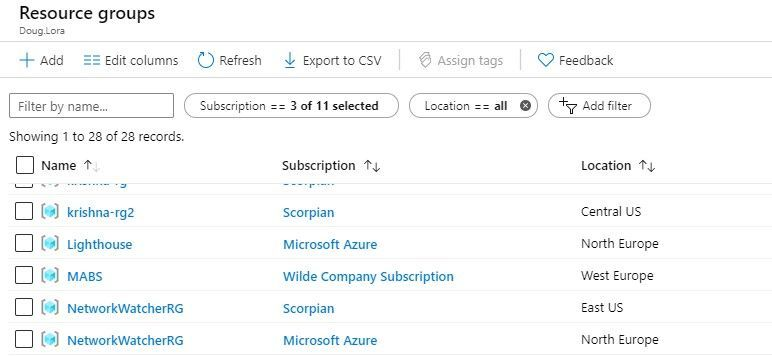
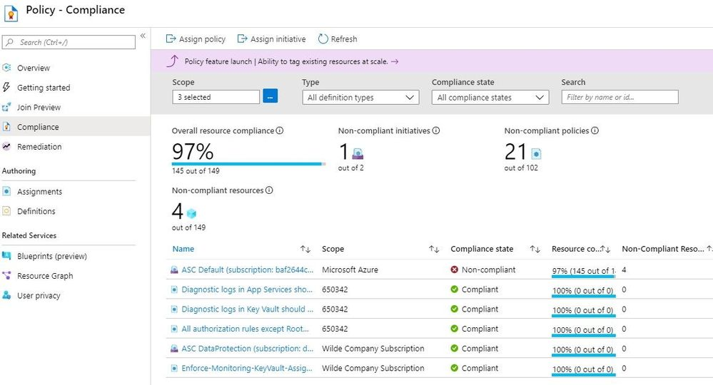
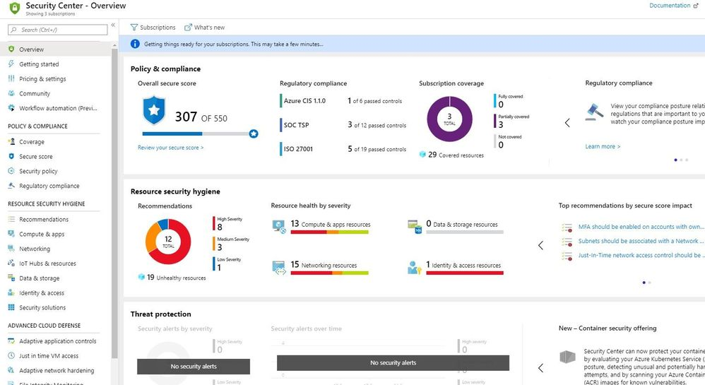
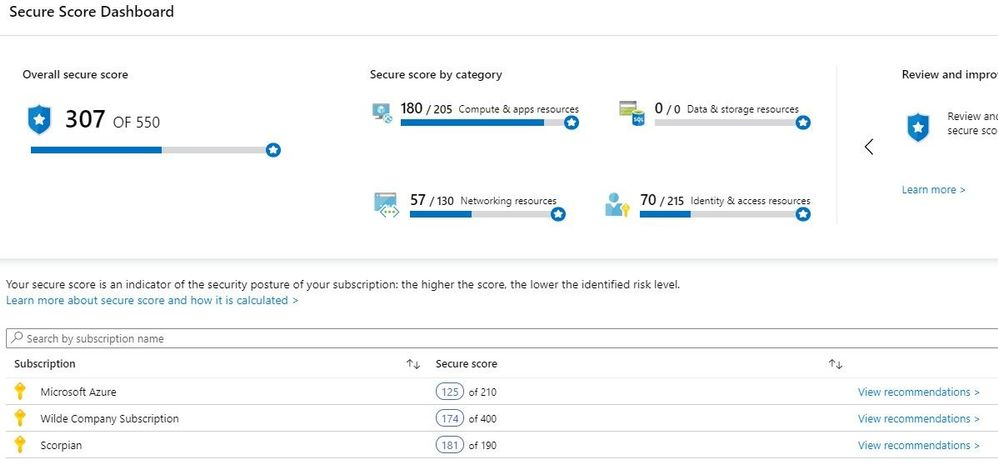

# Managing security with Azure Lighthouse and Azure Arc

# 基于 Azure Lighthouse 和 Azure Arc 的安全管理

<ContentMeta />

I've previously blogged about Azure Lighthouse, for [managing multiple difference Azure tenancies](https://techcommunity.microsoft.com/t5/ITOps-Talk-Blog/Manage-multiple-Azure-tenancies-with-Azure-Lighthouse/ba-p/833928?WT.mc_id=itopstalk-blog-socuff). This capability is useful for both Managed Service Providers, with support arrangements for multiple customers, and for large or complex Enterprise organizations (for example, if there are sub-brands or franchisees). Onboarding is done via deploying an Azure Resource Manager template or publishing an Azure Marketplace offer (public or private), which enables delegated administration into the other tenancies.

我以前写过一篇关于 Azure Lighthouse 的博文，介绍了[管理不同的 Azure 租户](https://techcommunity.microsoft.com/t5/ITOps-Talk-Blog/Manage-multiple-Azure-tenancies-with-Azure-Lighthouse/ba-p/833928?WT.mc_id=itopstalk-blog-socuff)。这个功能对于面向多客户的托管服务提供商，以及庞大复杂的企业组织（比如，有子品牌的或连锁加盟的企业集团）来讲，都很有用。通过部署 Azure 资源管理器模板，或发布一个（公有或私有的） Azure 市场报价，即可以完成交付，这将把管理权委托给其他租户。

This allows service providers, from the account in their own primary Azure tenancy, to have visibility of all of their customer's Azure resources and to be able to act on them, from the Azure Portal, CLI or APIs. 

这样一来，服务商就可以在他们自己的 Azure 主租户上查看他们客户的 Azure 资源，并且能够通过 Azure Portal、命令行或 APIs 来对其进行操作。

*Resources from multiple Azure tenancies, visible via the Azure Portal.* 

*在这个 Azure Portal 上，可以看到不同的 Azure 租户的资源。*

**The best way to unlock the power of this tool is to first decide what you're going to manage** - and security is always a good place to start. 

**解锁这个工具强大功能的最好方式，就是首先确定你要管理什么，** 而安全性总不失为一个好的开始。

First, we want to make sure that all of the resources across our customers are compliance to the [default set of security policies](https://docs.microsoft.com/azure/security-center/security-center-policy-definitions?WT.mc_id=itopstalk-blog-socuff) that the Azure Security Center monitors by default. In this picture, you can see that one of our customer subscriptions has 4 non-compliant resources against that policy initiative, totally 21 policies that are non-compliant.

首先，我们需要确保我们客户的所有资源都是符合[默认安全政策](https://docs.microsoft.com/azure/security-center/security-center-policy-definitions?WT.mc_id=itopstalk-blog-socuff)的规定的，这表示默认由 Azure 安全中心对其进行监管。在这张图片中，你可以看到我们有一位客户的子信息有4个不符合初始政策的资源，一共违背了21条政策。

From here, we can drill down into those 4 resources and see what needs remediation in each, without having to switch logins into a different tenancy.

在这里，我们可以直接深入这4个资源来查看我们需要如何修补他们，而非要切换登录到另一个租户账号上。

Next, we'll take a look at the Azure Security Center, and see not only an overall secure score but also recommended security hygiene measures, regulatory compliance and security alerts, aggregated across all of the tenancies we have access in to. For partners providing Security-as-a-Service offers, this provides you with a great task list, and large Enterprises can now get a single picture of their security risk across their multiple environments.

接下来，我们来看一看 Azure 安全中心，在这里不仅可以查看到整体的安全评分，还可看到建议的安全管理措施、政策符合情况以及（潜在）安全问题预警。这里集合了所有我们有权限管理的租户的安全信息。对于提供“安全即服务”的合作伙伴来讲，这将为你提供一个很棒的任务清单，而大企业可以有一个其在不同环境的安全风险的整体的视图。

 

And if we want a more granular level of detail, we can bring up the Secure Score details for each individual tenancy:

 而如果我们想要查看更进一步的细节，我们可以对每个单独的租户查看安全评分细节。

 

**But wait, there's more!**

**请等一下，这里还有更多内容！**

With the recently announced [Azure Arc (preview)](https://docs.microsoft.com/azure/azure-arc/servers/overview?WT.mc_id=itopstalk-blog-socuff), non-Azure Windows and Linux Servers can now be onboarded into Azure as connected machines, allowing you to query Azure Policies inside the VMs (guest configuration) and ingest log data into Log Analytics. It's early days for Azure Arc, with support for more services coming soon, but now those connected machines can be queried for their operating system-level security settings via Azure Policy. You've now just unlocked the full breadth of your customer's server environment, whether their servers are in Azure, in a data center, on premises or even in someone else's Cloud! 

近日所发布的 [Azure Arc (preview)](https://docs.microsoft.com/azure/azure-arc/servers/overview?WT.mc_id=itopstalk-blog-socuff) 技术，使非 Azure Windows 系统的 Linux 服务器现在也可以作为一台连接机，部署 Azure 服务，允许你在虚拟机上以用户身份检查 Azure 政策，并接收日志数据写入日志分析。 Azure Arc 正刚刚萌芽，更多的服务支持将很快被推出，而现在，这些连接好的机器已经可以基于 Azure 政策对其系统运行的安全配置水平进行评测了。你现在已经完全解锁了你的客户服务器环境，无论他们的服务器是在 Azure 中，在某个数据中心里，在其本地内部部署的，还是在其他人的云平台中！

As the capabilities of both [Azure Lighthouse](https://docs.microsoft.com/azure/lighthouse/concepts/cross-tenant-management-experience?WT.mc_id=itopstalk-blog-socuff) and Azure Arc grow, this tool will become even more powerful as a centralized management capability for partners and large Enterprises. And remember, if the Azure Portal isn't your thing, you can automate those tasks through the CLI or APIs at scale now, across multiple tenancies. I just wish I could share what's on the roadmap next!   

随着 [Azure Lighthouse](https://docs.microsoft.com/azure/lighthouse/concepts/cross-tenant-management-experience?WT.mc_id=itopstalk-blog-socuff) 和 Azure Arc 技术的增强，这个工具为合作伙伴与大型企业提供集中式管理的服务能力将更加强大。请记住，如果你不喜欢 Azure Portal ，你还可尝试大规模地使用命令行或 APIs j对多个租户进行任务的自动化管理。我只是希望我分享的技术图能为你带来启发！

For more information on Azure Lighthouse, including onboarding options, visit: <https://docs.microsoft.com/azure/lighthouse/?WT.mc_id=itopstalk-blog-socuff>

更多关于 Azure Lighthouse 的信息，包括部署选项，请浏览：
<https://docs.microsoft.com/azure/lighthouse/?WT.mc_id=itopstalk-blog-socuff>
